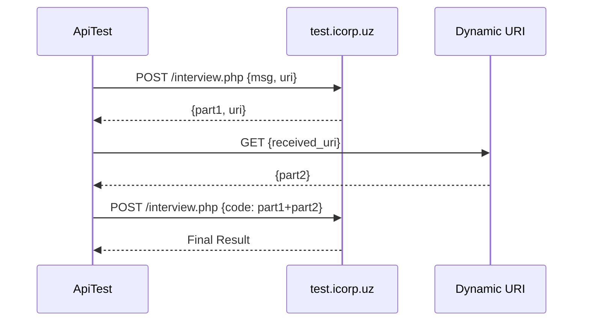

# API Test Solution

Решение тестового задания для собеседования - взаимодействие с API через цепочку HTTP-запросов.

## 📋 Описание

PHP-скрипт выполняет последовательность из трех HTTP-запросов:
1. POST-запрос для получения первой части кода
2. GET-запрос для получения второй части кода
3. POST-запрос с объединенным кодом для получения финального результата

## 🚀 Быстрый старт

### Требования
- PHP >= 7.0
- Расширение cURL
- Расширение JSON

### Проверка требований
```bash
php -v
php -m | grep curl
php -m | grep json
```

### Установка и запуск
```bash
# Клонируйте репозиторий
git clone https://github.com/Azizbekutkirovich/ICORP-interview.git
cd ICORP-interview

# Запустите скрипт
php index.php
```

## 💻 Инструкции запуска

### Способ 1: Прямое выполнение
```bash
php index.php
```

### Способ 2: Через веб-сервер
```bash
# Запустите встроенный сервер PHP
php -S localhost:8000

# Откройте в браузере
http://localhost:8000/index.php
```

### Способ 3: Пошаговое выполнение
```bash
php index.php
```

## 🏗️ API Reference

### Класс ApiTest

#### Свойства
| Свойство | Тип | Описание |
|----------|-----|----------|
| `$endpoint` | string | URL конечной точки API |
| `$timeout` | int | Таймаут запроса в секундах |

#### Методы
| Метод | Параметры | Возвращает | Описание |
|-------|-----------|------------|----------|
| `execute()` | - | array/string | Выполняет полную цепочку запросов |
| `firstRequest()` | - | array | Первый POST-запрос |
| `secondRequest($url)` | string $url | array | GET-запрос по URL |
| `finalRequest($code)` | string $code | array | Финальный POST-запрос |
| `sendRequest($url, $method, $data)` | string, string, array | array | Универсальный HTTP-запрос |

## 🔧 Конфигурация

### Изменение endpoint
```php
$client = new ApiTest();
$client->endpoint = "https://your-api.com/endpoint";
$client->timeout = 30;
```

### Переменные окружения (опционально)
```bash
export API_ENDPOINT="https://test.icorp.uz/private/interview.php"
export API_TIMEOUT=20
```

## 🐛 Отладка

### Включение детального логирования
```php
// Добавьте в начало файла
error_reporting(E_ALL);
ini_set('display_errors', 1);

// Для логирования cURL
$options[CURLOPT_VERBOSE] = true;
```

### Просмотр логов
```bash
tail -f /var/log/php_errors.log
```

## 📋 Возможные ошибки и решения

| Ошибка | Причина | Решение |
|--------|---------|---------|
| `CURL Error: Could not resolve host` | Проблемы с DNS/интернетом | Проверить подключение |
| `HTTP Error: 404` | Неверный endpoint | Проверить URL |
| `Decode error` | Некорректный JSON | Проверить ответ сервера |

## 🚀 Развертывание

### Docker (опционально)
```dockerfile
FROM php:8.1-cli
RUN docker-php-ext-install curl json
COPY . /app
WORKDIR /app
CMD ["php", "api_test.php"]
```

```bash
docker build -t api-test .
docker run api-test
```

## 📝 Алгоритм работы



## 📄 Лицензия

MIT License - создано для тестового задания

## 👨‍💻 Автор

Создано в рамках технического собеседования

---